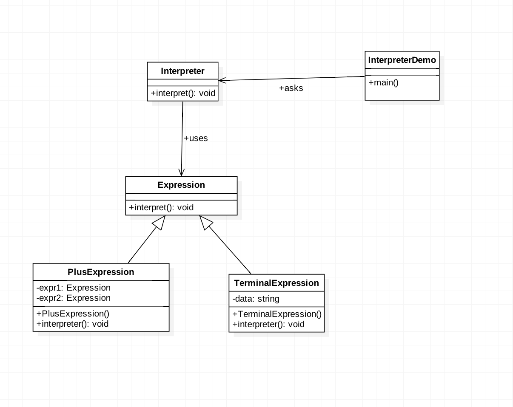
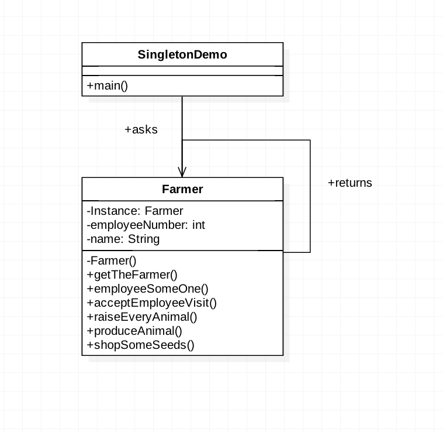
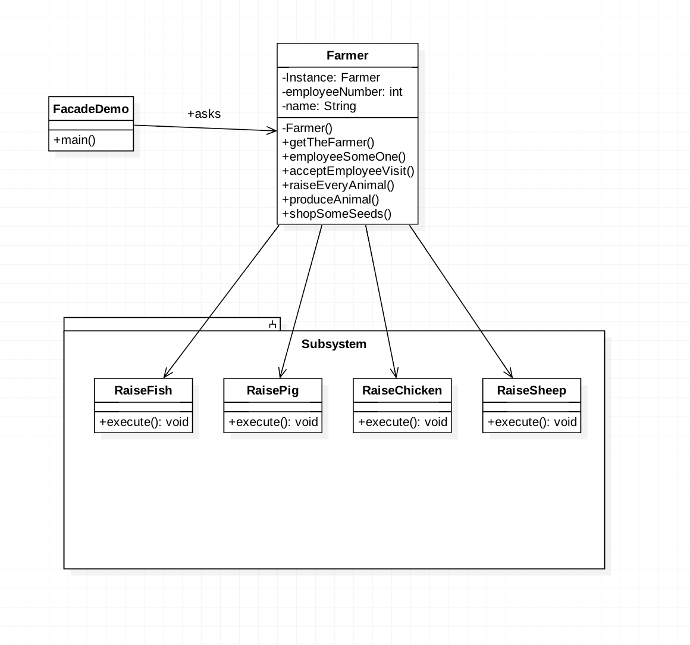
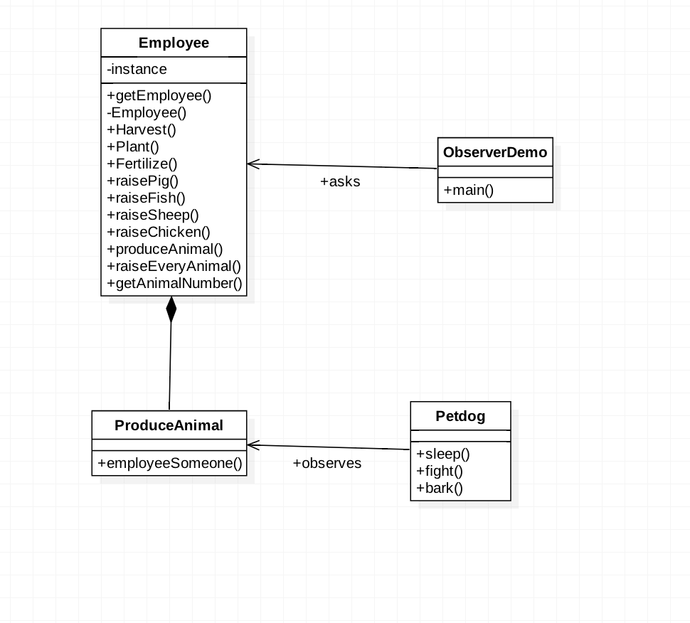

# 3. design pattern 详述

## 3.1 Command

​	命令模式（Command Pattern）将一个请求封装成一个对象，从而使用不同的请求把客户端参数化，对请求排队或者记录请求日志，可以提供命令的撤销和恢复功能。这是一种数据驱动的设计模式，它属于行为型模式。请求以命令的形式包裹在对象中，并传给调用对象。调用对象寻找可以处理该命令的合适的对象，并把该命令传给相应的对象，该对象执行命令。

​	通过使用此设计模式降低了系统耦合度，容易添加新命令，同时也会使得系统中有过多具体命令类，过于繁杂。

### 3.1.1 Api描述

​	在选择养不同的动物时，采用了Command设计模式，在Order类中定义了RaisePig, RaiseSheep, RaiseChicken, RaiseFish四个操作，而这些操作在Order中调用，具体的实现机制被封装好。

|       函数名        |                         作用                          |
| :-----------------: | :---------------------------------------------------: |
|   void execute()    | 执行调用养的行为，通过ChickenList增加相对应的动物数量 |
|   void addOrder()   |                   添加相对应的命令                    |
| void launchOrders() |                     调用命令执行                      |

### 3.1.2  class diagram

​	

## 3.2 Decorator

​	装饰器模式（Decorator Pattern）允许向一个现有的对象添加新的功能，同时又不改变其结构。这种类型的设计模式属于结构型模式，它是作为现有的类的一个包装。这种模式创建了一个装饰类，用来包装原有的类，并在保持类方法签名完整性的前提下，提供了额外的功能。

​	装饰器模式相比生成子类更为灵活，能够扩展一个类的功能，并且可以代替继承。

### 3.2.1 Api描述

​	我们假设了一种情况，当农场中没有雇员的时候应该怎么办。按照正常情况来说，农场主在这个时候就会做起雇员应该做的事。FarmerDecorator类继承了People类，使得Farmer在没有雇员的情况类通过FarmerDecorator()实现装饰后描述，即可以做雇员应做的事。

|           函数名           |                             作用                             |
| :------------------------: | :----------------------------------------------------------: |
|          Farmer()          |                      Farmer类的构造函数                      |
| void acceptEmployeeVisit() | 查看雇员的数量，以此判断是否调用FarmerDecorator类去装饰Farmer |
|     FarmerDecorator()      | FarmerDecorator类的构造函数，通过装饰使得Farmer可以进行养这个操作 |
|      void raisePig()       | 增加养殖动物，同样的函数还包括raiseFish, raiseSheep, raiseChicken |

### 3.2.2 class diagram

​	

## 3.3 Flyweight

​	享元模式（Flyweight Pattern）是说在有大量对象时，有可能会造成内存溢出，我们把其中共同的部分抽象出来，如果有相同的业务请求，直接返回在内存中已有的对象，避免重新创建。使用这个设计模式时，大大减少了对象的创建，降低系统的内存，使效率提高。但是提高了系统的复杂度，容易造成系统的混乱。

### 3.3.1 Api描述

​	通过EmployeeFactory来创建Employee，而Employee类继承自Farmer类。通过这种设计模式运用共享技术有效地支持大量细粒度的对象，避免重新的创建，占用内存。

​	

|        函数名         |                            作用                             |
| :-------------------: | :---------------------------------------------------------: |
|    employeeSomeOne    |                    Farmer雇佣雇员的操作                     |
| Emplyee getEmployee() | 通过实现雇佣雇员的操作实现的具体行为，通过类EmployeeFactory |

### 3.3.2 class diagram

## 3.4 Interpreter

​	解释器模式（Interpreter Pattern）提供了评估语言的语法或表达式的方式，它属于行为型模式。这种模式实现了一个表达式接口，该接口解释一个特定的上下文。这种模式被用在 SQL 解析、符号处理引擎等。给定一个语言，定义它的文法表示，并定义一个解释器，这个解释器使用该标识来解释语言中的句子。

### 3.4.1 Api描述

​	在这个项目中，有很多重复的加法功能，如果一种特定类型的问题发生的频率足够高，那么可能就值得将该问题的各个实例表述为一个简单语言中的句子。这样就可以构建一个解释器，该解释器通过解释这些句子来解决该问题。

​	

|      函数名      |         作用         |
| :--------------: | :------------------: |
| void interpret() | 实现解释器的具体操作 |

### 3.4.2 class diagram

​	

## 3.5 Singleton

​	单例模式（Singleton Pattern）这种设计模式属于创建型模式，它提供了一种创建对象的最佳方式。这种模式涉及到一个单一的类，该类负责创建自己的对象，同时确保只有单个对象被创建。这个类提供了一种访问其唯一的对象的方式，可以直接访问，不需要实例化该类的对象。

### 3.5.1 Api描述

​	我们将Farmer定义为一个单例。

### 3.5.2 class diagram

​	

## 3.6 Facade

​	外观模式（Facade Pattern）隐藏系统的复杂性，并向客户端提供了一个客户端可以访问系统的接口。这种类型的设计模式属于结构型模式，它向现有的系统添加一个接口，来隐藏系统的复杂性。这种模式涉及到一个单一的类，该类提供了客户端请求的简化方法和对现有系统类方法的委托调用。为子系统中的一组接口提供一个一致的界面，外观模式定义了一个高层接口，这个接口使得这一子系统更加容易使用。在层次化结构中，可以使用外观模式定义系统中每一层的入口。

### 3.6.1 Api描述

​	我们为子系统中的一组接口RaiseFish, RaisePig, RaiseChicken, RaiseSheep提供一个一致的界面，Facade模式通过Farmer类进行调用，使得这一子系统更加容易使用。

### 3.6.2 class diagram

## 3.7 Proxy

​	代理模式（Proxy Pattern）中，一个类代表另一个类的功能。这种类型的设计模式属于结构型模式。在代理模式中，我们创建具有现有对象的对象，以便向外界提供功能接口。为其他对象提供一种代理以控制对这个对象的访问。

### 3.7.1 Api 描述

​	我们在此时假设一种情况，农场主在又雇员在的时候是不会自己动手工作的，因此农场主需要指派雇员进行工作，所以农场主此时是代理，因此我们想要ProduceAnimal时，我们需要农场主做代理指派雇员进行工作，雇员是这个操作的执行者。

### 3.7.2 class diagram

## 3.8 Observer

​	当对象间存在一对多关系时，则使用观察者模式（Observer Pattern）。比如，当一个对象被修改时，则会自动通知它的依赖对象。观察者模式属于行为型模式。定义对象间的一种一对多的依赖关系，当一个对象的状态发生改变时，所有依赖于它的对象都得到通知并被自动更新。

### 3.8.1 Api 描述

​	当我们要进行收割所有植物的时候，宠物狗是一个观察者，发现此时产生收割所有植物这个动作的时候，这个观察者将会bark。

### 3.8.3 class diagram

### 	

## 3.9 Iterator 

​	迭代器模式（Iterator Pattern）是 Java 和 .Net 编程环境中非常常用的设计模式。这种模式用于顺序访问集合对象的元素，不需要知道集合对象的底层表示。迭代器模式属于行为型模式。提供一种方法顺序访问一个聚合对象中各个元素, 而又无须暴露该对象的内部表示

### 3.9.1 Api 描述

​	在AnimalList类中使用迭代器模式，并且在Employee类中获取迭代器并且使用。

### 3.9.2 class diagram

